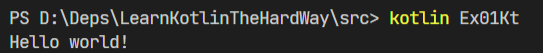

# 习题1 第一个程序

当一切都已经安装完毕，你需要确认一切都安装正常，最好的方式就是编写一个程序。

## 示例

现在，新建一个名为`ex01.kt`的文件，并用你选择的文本编辑器打开它，向其中输入以下代码：

```Kotlin
fun main(args: Array<String>) {
    println("Hello world!")
}
```

现在，在同一路径中打开你的终端，执行`kotlinc ./ex01.kt`指令进行编译，你应该在ex01.kt的相同路径下看到一个名为`Ex01Kt.class`的文件。

现在，再在这个路径中执行`kotlin Ex01Kt`，你应该能看到这样的结果：  
  
这意味着我们成功编写、编译并执行了我们的第一个Kotlin程序，好耶。

另外，我需要补充一点的是，`ex01.kt`，并不是一个kotlin源文件的好名字，用在这里只是单纯的为了指出这段代码是习题01的代码。良好的命名方式会在后续习题中介绍。

## 代码解释

这一个短短的三行代码的程序声明了一个叫main的函数，在kotlin中，当你运行一个程序时，它的main函数总是第一个被调用。在main函数中，我们调用了println函数来打印我们的老朋友“Hello world！”。

在Kotlin中，我们使用fun关键词声明一个函数，关于函数的声明我们将在后续章节中详细介绍。

## 应该看到的结果

``` bash
$>kotlinc /ex01.kt
ex01.kt:1:10: warning: parameter 'args' is never used
fun main(args: Array<String>) {
         ^
$> kotlin Ex01Kt
Hello world!
```

在这一个结果以及后面习题的结果中，以`$>`开头的行是我输入的内容，没有这一开头的行是程序运行的输出。

第一个指令执行了kotlinc命令，将输入的文件`ex01.kt`编译成了字节码。可以注意到的是输出中会提示`parameter 'args' is never used`，暂时不用管它的含义。

第二个指令执行了kotlin命令，它在当前目录下寻找符合输入的参数（本例中即`Ex01Kt`）的类的文件（本例中它找到了`Ex01Kt.class`文件），读取这个文件中的类、寻找并执行了这个类中的main函数。

你可能会困惑于“这个文件中的类”是什么意思，这涉及到了一点和Java有关的知识，我们暂时先不去管这个问题。有关的内容将在后续习题中介绍。

可以看到，第二个命令的输出正是我们所期待的老伙计“Hello world！”。

## 如何破坏程序

在本书中，我将尽可能地在每一个章节中提供一个破坏程序的方法。

对于这个程序，我希望你能删除一些部分，再次编译，看看会有什么错误。

## 附加任务

+ 删除`args: Array<String>`，看看还能不能正常编译和运行；
+ 修改程序，让它打印更多内容；
+ 再一行的起始位置添加`//`，看看会发生什么。
